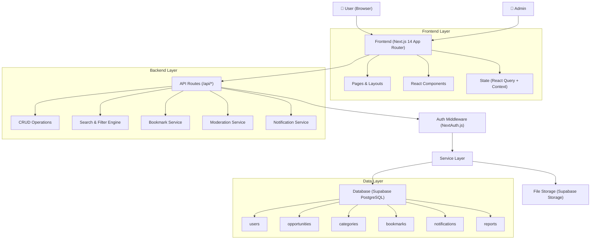
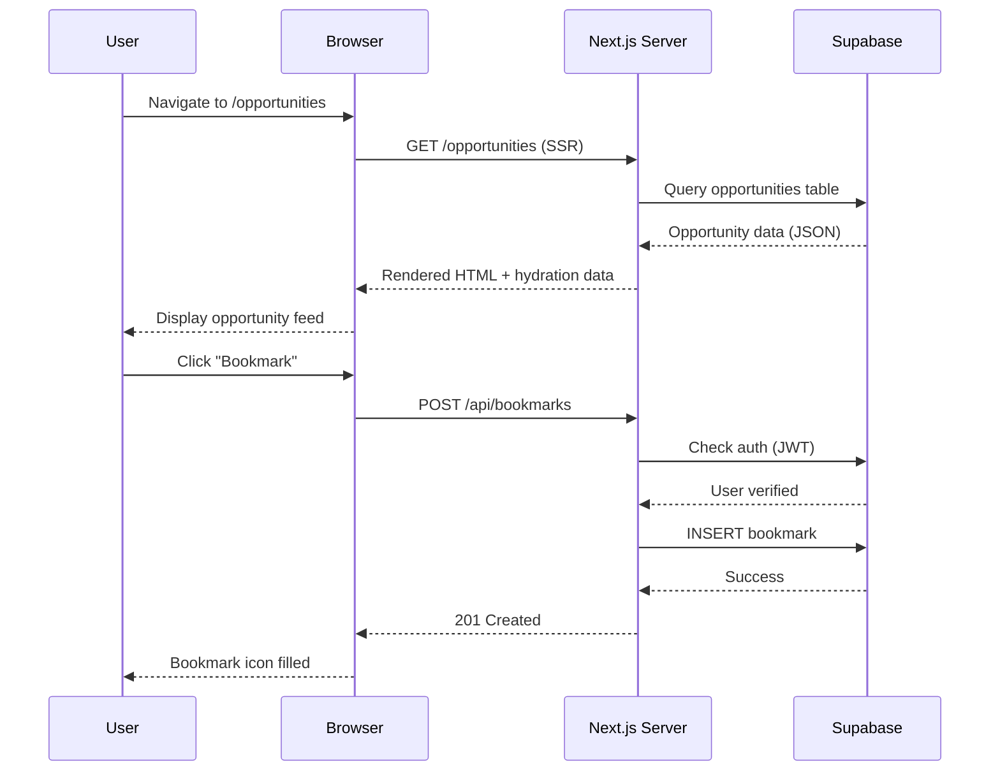
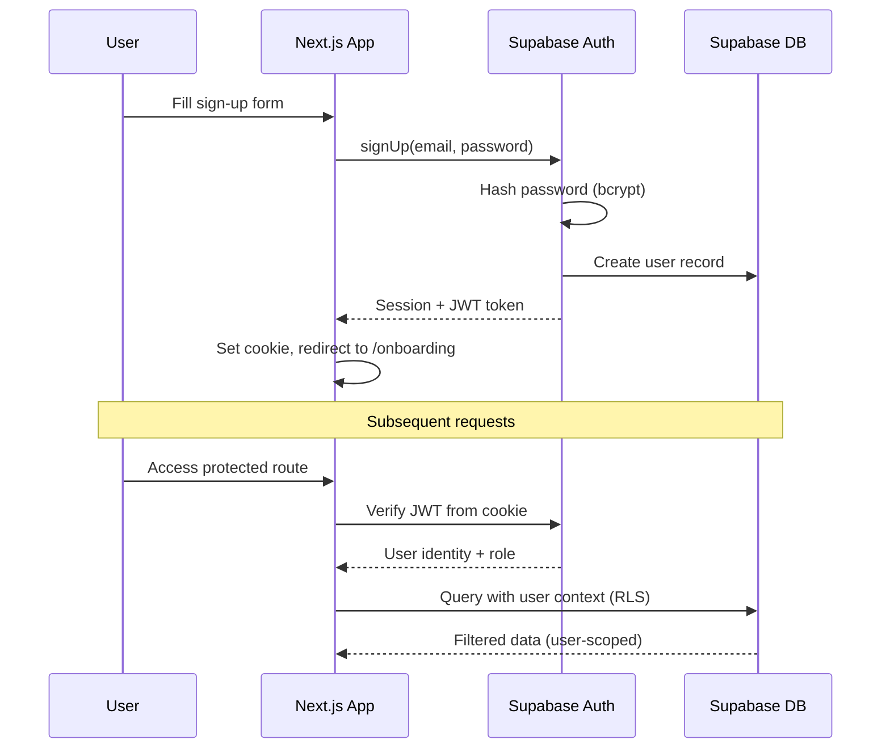
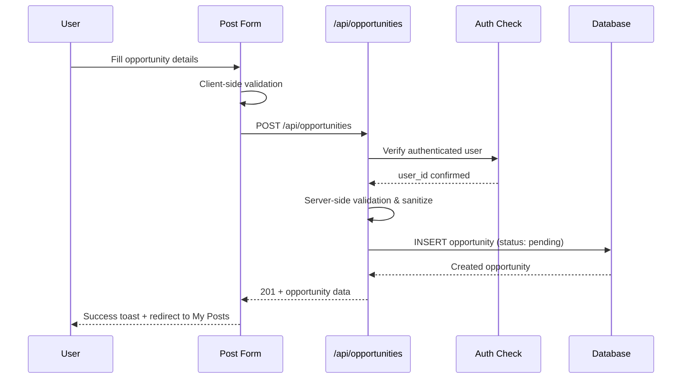
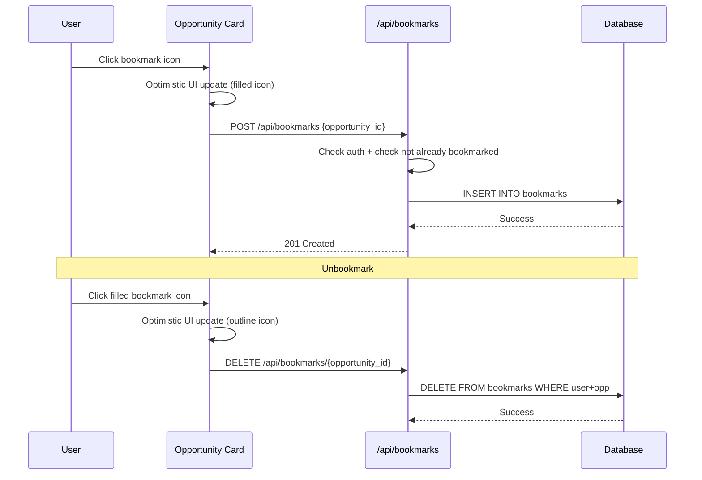
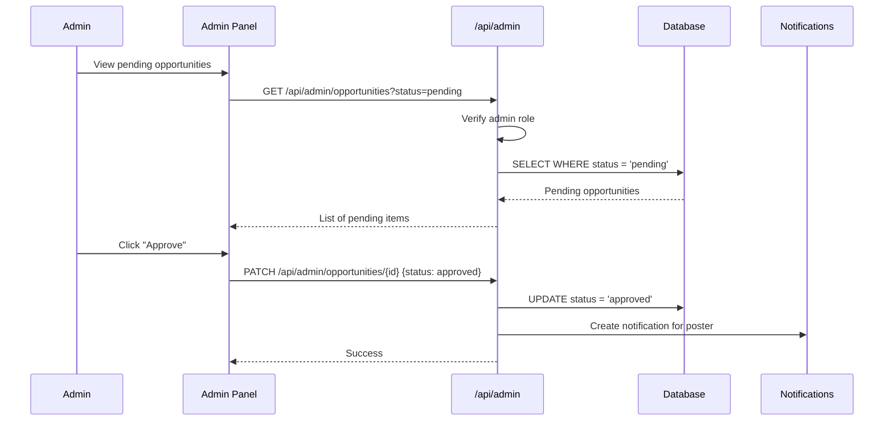

# Opportunity Board — Architecture

## System Architecture Overview



## Technology Stack

| Layer | Technology | Rationale |
|-------|-----------|-----------|
| **Framework** | Next.js 14 (App Router) | Full-stack React framework with API routes, SSR, file-based routing |
| **Language** | TypeScript | Type safety, better DX, catch errors at compile time |
| **Styling** | Tailwind CSS 3 | Matches Stitch output (Stitch generates Tailwind), rapid development |
| **Database** | Supabase (PostgreSQL) | Free tier, real-time, built-in auth, instant API, hosted |
| **Auth** | Supabase Auth | Email/password + OAuth (Google, GitHub), JWT tokens, RLS |
| **State** | React Query + React Context | Server state caching, optimistic updates, minimal boilerplate |
| **Icons** | Material Symbols Outlined | Matches Stitch design exactly |
| **Font** | Plus Jakarta Sans (Google Fonts) | Stitch design system font |
| **Deployment** | Vercel | Zero-config Next.js deployment, free tier |

## Why This Stack?

1. **Next.js 14** — Stitch already generates Tailwind HTML; Next.js App Router gives us file-based routing, API routes (no separate backend), and server components for performance
2. **Supabase** — Eliminates backend complexity: hosted PostgreSQL + built-in auth + row-level security + real-time subscriptions + file storage, all with a generous free tier
3. **Tailwind CSS** — The Stitch project outputs Tailwind utility classes directly, so using Tailwind means near-1:1 translation of the design
4. **TypeScript** — Catches data shape issues between frontend/backend early, better maintainability

---

## Request Flow



## Authentication Flow



## Opportunity Creation Flow



## Bookmark Flow



## Admin Moderation Flow



## Folder Structure

```
opportunity-board/
├── docs/                          # Project documentation
├── public/                        # Static assets
│   ├── icons/
│   └── images/
├── src/
│   ├── app/                       # Next.js App Router
│   │   ├── (auth)/                # Auth route group
│   │   │   ├── login/
│   │   │   ├── signup/
│   │   │   ├── forgot-password/
│   │   │   └── reset-password/
│   │   ├── (main)/                # Main app route group
│   │   │   ├── page.tsx           # Home / Discover
│   │   │   ├── opportunities/
│   │   │   │   └── [id]/
│   │   │   ├── saved/
│   │   │   ├── my-posts/
│   │   │   │   └── [id]/edit/
│   │   │   ├── post-opportunity/
│   │   │   ├── profile/
│   │   │   └── notifications/
│   │   ├── admin/                 # Admin route group
│   │   │   └── opportunities/
│   │   ├── onboarding/
│   │   ├── api/                   # API routes
│   │   │   ├── auth/
│   │   │   ├── opportunities/
│   │   │   ├── bookmarks/
│   │   │   ├── profile/
│   │   │   ├── notifications/
│   │   │   └── admin/
│   │   ├── layout.tsx
│   │   └── globals.css
│   ├── components/                # Reusable UI components
│   │   ├── ui/                    # Primitive UI (Button, Input, Badge)
│   │   ├── layout/                # Navbar, Footer, Sidebar
│   │   ├── opportunities/         # OpportunityCard, FilterPanel
│   │   └── forms/                 # FormField, OpportunityForm
│   ├── lib/                       # Utilities
│   │   ├── supabase/              # Supabase client config
│   │   ├── validations/           # Zod schemas
│   │   └── utils.ts               # Helper functions
│   ├── hooks/                     # Custom React hooks
│   ├── types/                     # TypeScript type definitions
│   └── constants/                 # App constants, seed data
├── supabase/
│   └── migrations/                # Database migrations
├── .env.local                     # Environment variables
├── next.config.js
├── tailwind.config.ts
├── tsconfig.json
└── package.json
```
