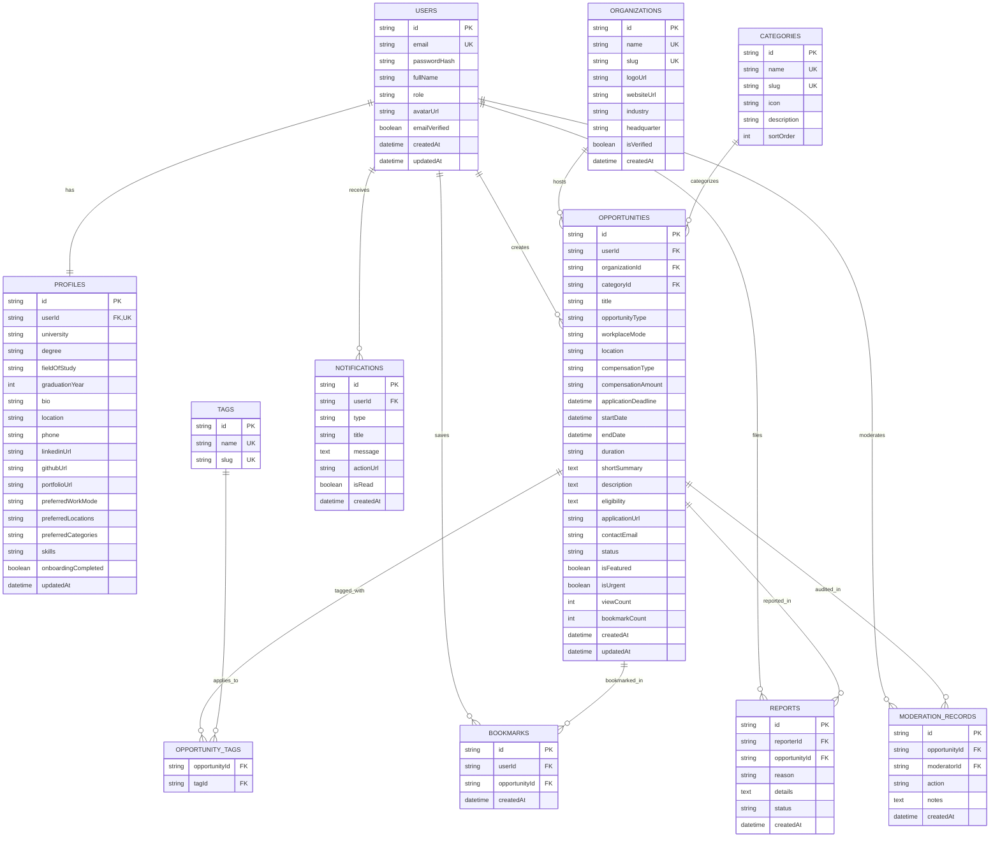

# Opportunity Board — Database Architecture & Schema

## Database Strategy

For optimal development speed, reliability, and zero external dependency risk during hackathon evaluation, Opportunity Board uses **Prisma ORM** with a clean database abstraction:
- **Local Development / Evaluation:** SQLite (`prisma/dev.db`) — zero configuration, fully self-contained, lightning fast, and persistence out-of-the-box.
- **Production Deployment:** PostgreSQL / Supabase — seamlessly supported by switching `provider = "postgresql"` in `prisma/schema.prisma` and providing `DATABASE_URL`.

All relationships, constraints, foreign keys, cascade rules, and indexes are defined in Prisma.

---

## Entity Relationship Diagram

---

## Detailed Model Specifications

### 1. `User`
- **`id`** (`String`, `@id`, `@default(cuid())`): Unique user identifier.
- **`email`** (`String`, `@unique`): Institutional or personal email.
- **`passwordHash`** (`String`): bcrypt hashed password.
- **`fullName`** (`String`): User's display name.
- **`role`** (`String`, `@default("USER")`): Access role (`"USER"`, `"ADMIN"`, `"MODERATOR"`).
- **`avatarUrl`** (`String?`): Profile picture URL.
- **`createdAt`** (`DateTime`, `@default(now())`).
- **`updatedAt`** (`DateTime`, `@updatedAt`).

### 2. `Profile`
- **`id`** (`String`, `@id`, `@default(cuid())`).
- **`userId`** (`String`, `@unique`): Foreign key to `User(id)` with `@onDelete: Cascade`.
- **`university`** (`String?`): e.g. "Stanford University".
- **`degree`** (`String?`): e.g. "B.S. Computer Science".
- **`fieldOfStudy`** (`String?`): e.g. "Artificial Intelligence & Systems".
- **`graduationYear`** (`Int?`): e.g. 2027.
- **`bio`** (`String?`).
- **`location`** (`String?`): e.g. "San Francisco Bay Area, CA".
- **`phone`** (`String?`).
- **`linkedinUrl`** (`String?`).
- **`githubUrl`** (`String?`).
- **`portfolioUrl`** (`String?`).
- **`preferredWorkMode`** (`String?`): JSON array or comma list (`"REMOTE,HYBRID"`).
- **`preferredCategories`** (`String?`): JSON array of category slugs.
- **`skills`** (`String?`): Comma-separated list of student skills.
- **`onboardingCompleted`** (`Boolean`, `@default(false)`).

### 3. `Organization`
- **`id`** (`String`, `@id`, `@default(cuid())`).
- **`name`** (`String`, `@unique`): e.g. "OpenAI", "Google DeepMind", "IBM Research Labs", "Figma".
- **`slug`** (`String`, `@unique`).
- **`logoUrl`** (`String?`).
- **`websiteUrl`** (`String?`).
- **`isVerified`** (`Boolean`, `@default(false)`): Controls verified partner badge.

### 4. `Category`
- **`id`** (`String`, `@id`, `@default(cuid())`).
- **`name`** (`String`, `@unique`): "Internships", "Hackathons", "Fellowships", "Workshops", "Competitions", "Scholarships", "Early Jobs", "Conferences".
- **`slug`** (`String`, `@unique`).
- **`icon`** (`String`): Material Symbols icon name (`"work"`, `"code_blocks"`, `"biotech"`, etc.).
- **`sortOrder`** (`Int`, `@default(0)`).

### 5. `Opportunity`
- **`id`** (`String`, `@id`, `@default(cuid())`).
- **`userId`** (`String`): Creator/poster ID.
- **`organizationId`** (`String`): Host organization.
- **`categoryId`** (`String`): Primary category classification.
- **`title`** (`String`): e.g. "Collegiate AI Residency & Research Fellow 2026".
- **`opportunityType`** (`String`): `"Internship"`, `"Hackathon"`, `"Fellowship"`, etc.
- **`workplaceMode`** (`String`): `"remote"`, `"onsite"`, `"hybrid"`.
- **`location`** (`String?`): e.g. "San Francisco, CA / Hybrid".
- **`compensationType`** (`String?`): `"paid"`, `"stipend"`, `"prize"`, `"scholarship"`, `"unpaid"`.
- **`compensationAmount`** (`String?`): e.g. "$9,500/mo + Housing".
- **`applicationDeadline`** (`DateTime?`): ISO deadline date.
- **`startDate`** (`DateTime?`).
- **`endDate`** (`DateTime?`).
- **`duration`** (`String?`): e.g. "12 Weeks".
- **`shortSummary`** (`String?`): Brief overview for card streams.
- **`description`** (`String`): Detailed markdown description.
- **`eligibility`** (`String?`): Eligibility criteria.
- **`applicationUrl`** (`String?`): External application link.
- **`contactEmail`** (`String?`).
- **`status`** (`String`, `@default("approved")`): `"pending"`, `"approved"`, `"flagged"`, `"rejected"`, `"closed"`.
- **`isFeatured`** (`Boolean`, `@default(false)`).
- **`isUrgent`** (`Boolean`, `@default(false)`): Computed or explicit urgency flag.
- **`viewCount`** (`Int`, `@default(0)`).
- **`bookmarkCount`** (`Int`, `@default(0)`).
- **`createdAt`** (`DateTime`, `@default(now())`).
- **`updatedAt`** (`DateTime`, `@updatedAt`).

### 6. `Tag` & `OpportunityTag`
- Tags for skills and domains (e.g. "AI & Machine Learning", "PyTorch", "UI/UX", "ClimateTech").
- Many-to-many join table between `Opportunity` and `Tag`.

### 7. `Bookmark`
- **`id`** (`String`, `@id`, `@default(cuid())`).
- **`userId`** (`String`): Scoped to authenticated user.
- **`opportunityId`** (`String`).
- **`createdAt`** (`DateTime`, `@default(now())`).
- **Unique Constraint:** `@@unique([userId, opportunityId])` prevents duplicate bookmarks.

### 8. `Notification`
- **`id`** (`String`, `@id`, `@default(cuid())`).
- **`userId`** (`String`).
- **`type`** (`String`): `"DEADLINE"`, `"MATCH"`, `"STATUS"`, `"SYSTEM"`.
- **`title`** (`String`).
- **`message`** (`String`).
- **`actionUrl`** (`String?`).
- **`isRead`** (`Boolean`, `@default(false)`).
- **`createdAt`** (`DateTime`, `@default(now())`).

### 9. `Report`
- User-submitted flags for broken links, spam, or scams.

### 10. `ModerationRecord`
- Audit log of admin actions (approval, rejection notes, revisions requested).

---

## Indexing Strategy

1. **Full-Text Keyword Search:**
   - Composite queries across `title`, `description`, and `organization.name`.
2. **Filters:**
   - Index on `status`, `opportunityType`, `workplaceMode`, `categoryId`.
3. **Deadlines:**
   - Index on `applicationDeadline ASC` for urgent closing queries.
4. **Ownership:**
   - Index on `userId` on `opportunities` and `bookmarks`.
