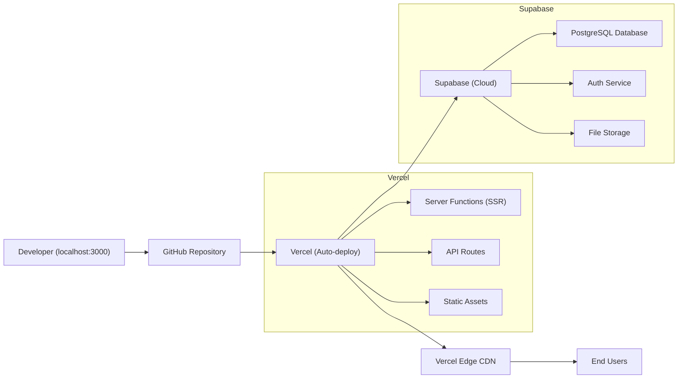

# Opportunity Board — Deployment

## Deployment Architecture



## Hosting

| Service | Provider | Tier | Purpose |
|---------|----------|------|---------|
| **Frontend + API** | Vercel | Free (Hobby) | Next.js hosting, SSR, API routes, CDN |
| **Database** | Supabase | Free | PostgreSQL, 500MB storage, 50K monthly active users |
| **Auth** | Supabase Auth | Free | Email/password + OAuth |
| **File Storage** | Supabase Storage | Free | Organization logos (1GB) |

## Build Process

```bash
# Install dependencies
npm install

# Run development server
npm run dev

# Build for production
npm run build

# Start production server (local testing)
npm start
```

## Production Deployment (Vercel)

1. **Connect GitHub repo** to Vercel project
2. **Set environment variables** in Vercel dashboard
3. **Auto-deploy** on push to `main` branch
4. **Preview deployments** on pull requests

### Vercel Configuration
```json
// vercel.json (if needed)
{
  "framework": "nextjs",
  "buildCommand": "npm run build",
  "outputDirectory": ".next"
}
```

## Environment Configuration

### Development
- `.env.local` with development Supabase credentials
- Hot reloading via `npm run dev`
- Local Supabase (optional, via `supabase start`)

### Production
- Environment variables set in Vercel dashboard
- Production Supabase project
- Automatic HTTPS via Vercel

## Domain Configuration
1. Default: `opportunity-board-xxx.vercel.app`
2. Custom domain: Add in Vercel → Domains
3. HTTPS: Automatic via Let's Encrypt

## Database Migrations
```bash
# Generate migration
supabase migration new create_tables

# Apply migrations
supabase db push

# Seed data
supabase db seed
```

## Post-Deployment Verification
- [ ] Homepage loads with hero section
- [ ] Opportunity feed displays seeded data
- [ ] Search and filters work correctly
- [ ] Sign up creates new account
- [ ] Sign in authenticates successfully
- [ ] Create opportunity form submits
- [ ] Edit and delete work on own posts
- [ ] Bookmark toggle persists
- [ ] Admin panel accessible to admin user
- [ ] Mobile responsive layout works
- [ ] API endpoints return correct responses
- [ ] Environment variables are not exposed in client bundle

## Monitoring & Logging
| Service | Purpose |
|---------|---------|
| Vercel Analytics | Page views, Web Vitals, errors |
| Vercel Logs | Server function logs, API errors |
| Supabase Dashboard | Database queries, auth events, storage usage |

## Rollback Strategy
- Vercel supports instant rollback to any previous deployment
- Database migrations are version-controlled and reversible
