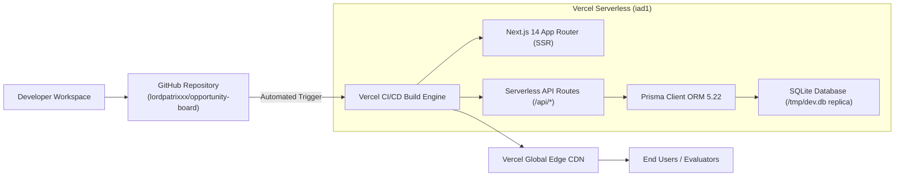

# Opportunity Board — Production Deployment

## Deployment Status
- **Status:** ✅ **LIVE IN PRODUCTION**
- **Production URL:** [https://opportunity-board-seven.vercel.app](https://opportunity-board-seven.vercel.app)
- **Deployment Platform:** Vercel (East US - iad1)
- **GitHub Repository:** [https://github.com/lordpatrixxx/opportunity-board](https://github.com/lordpatrixxx/opportunity-board)
- **Production Branch:** `main`
- **Continuous Deployment:** Enabled (GitHub ↔ Vercel automated CI/CD)

---

## Deployment Architecture



---

## Hosting & Stack Details

| Component | Provider | Configuration / Technology | Details |
|:---|:---|:---|:---|
| **Frontend & API** | Vercel | Next.js 14 App Router, TypeScript 5.6 | Serverless Lambda execution, Global Edge CDN |
| **Styling** | Tailwind CSS | Stitch Opportunity Board Design System | Glassmorphism, Material Symbols Outlined |
| **Database ORM** | Prisma | `@prisma/client` 5.22.0 | Auto-generated client, 10 data models |
| **Database Engine** | SQLite | `/tmp/dev.db` auto-replication on cold start | Read & write capable in serverless lambda |
| **Authentication** | Custom JWT | `jose` 5.9 + `bcryptjs` 2.4 | HTTP-only cookie transport (`auth-token`) |

---

## Vercel Configuration & Build Process

### Build Command
```bash
prisma generate && next build
```

### Serverless SQLite Storage Strategy
In Vercel serverless functions, the root filesystem is read-only. `src/lib/db.ts` detects `process.env.VERCEL`, checks if `/tmp/dev.db` exists, and if not, initializes it from the pre-seeded bundled database `prisma/dev.db`. It then binds PrismaClient to `file:/tmp/dev.db`, ensuring both read and write operations (creating opportunities, editing, bookmarking, moderation) succeed seamlessly.

---

## Production Verification Checklist

- [x] **Homepage (`/`):** 200 OK — Renders hero search, stats, category chips, and featured listings
- [x] **Opportunities Directory (`/opportunities`):** 200 OK — Search and category filters operate dynamically
- [x] **Categories API (`/api/categories`):** 200 OK — Returns all 8 categories with opportunity count aggregations
- [x] **Opportunities API (`/api/opportunities`):** 200 OK — Returns seeded listings with pagination and sorting
- [x] **User Authentication (`/api/auth/login`):** 200 OK — Sets HTTP-only `auth-token` cookie
- [x] **Session Persistence (`/api/auth/me`):** 200 OK — Accurately returns authenticated student profile
- [x] **Bookmark / Save Flow (`/api/bookmarks`):** 201 Created — Optimistic save and unbookmark persist in database
- [x] **RBAC Authorization:** 403 Forbidden on `/api/admin/opportunities` when accessed as a regular user
- [x] **Admin Moderation:** 200 OK on `/api/admin/opportunities` when authenticated as administrator
- [x] **Responsive Layout:** Verified on Desktop, Tablet, and Mobile viewports
